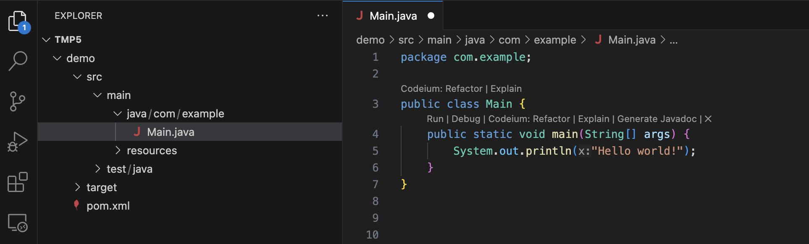

# learn-java

## 第一个java项目
当前目录创建 Hello.java, 即可运行.

## vscode 创建maven项目
1. 按快捷键 Ctrl+Shit+p调出命令选项板
2. 在命令选项板中输入 Java: Create Java Project 来创建一个Java 项目
3. 点击之后选中项目的类型， 也就是选择项目的构建工具（比如Maven, Gradle）

